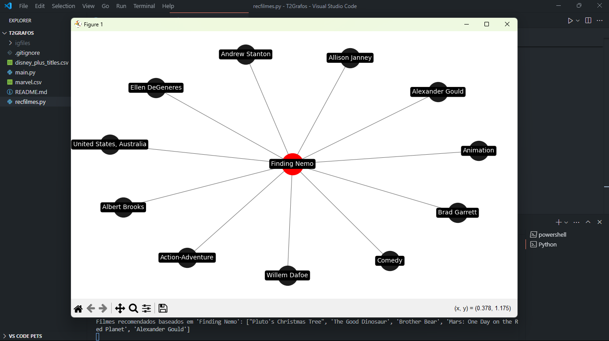
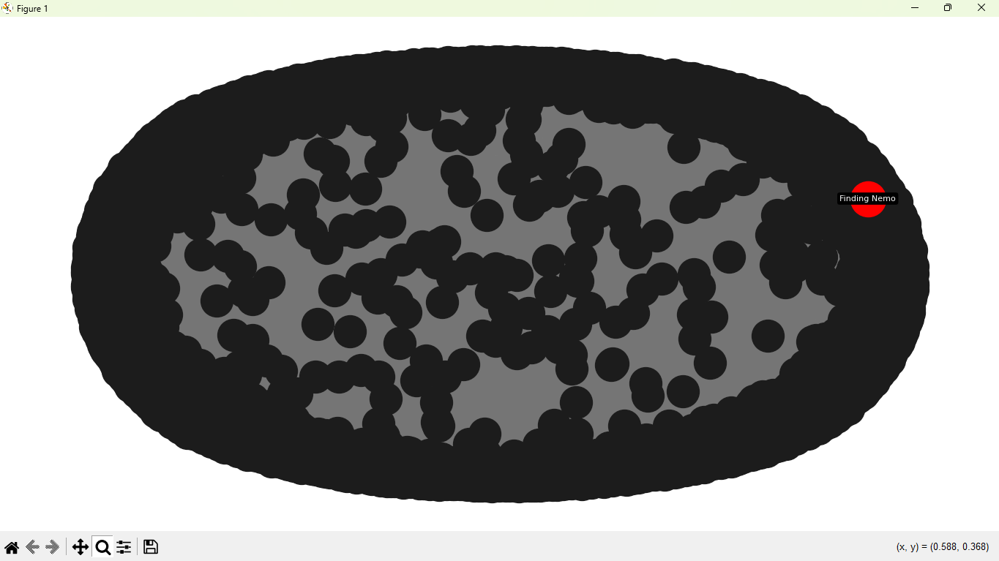

Trabalho para a disciplina de Teoria dos Grafos.

O trabalho inicialmente foi desenvolvido em python por meio do google collab nos computadores da faculdade e posteriormente completo por meio do aplicativo Visual Studio Code em um Windows 11 com auxilio do chatgpt para correção de códigos e sugestões de melhorias.

Dentro do diretório do projeto, há dois arquivos python. O primeiro, main.py, foi feito antes da disponibilização dos materiais para o trabalho, baseado nas descrições do que deveria ser feito em aula. O segundo, recfilmes.py, foi feito após o recebeminto do pdf e csv, sendo feito com base no arquivo anterior, mas com adaptações para se adequar aos requisitos do trabalho. As principais alterações dizem respeito a leitura do csv e a adição da lógica de clusters, inexistente no primeiro.

Atenção! Há duas visualizações do grafo, mesmo após a primeira aparecer, o programa leva alguns segundos para carregar a segunda.

Resultado ao pesquisar pelo filme 'Finding Nemo'

Essa é uma visualização do filme e seus vértices vizinhos, feita para uma melhor compreensão do grafo. Há também, a visualização do grafo completo, mas que devido ao tamanho do grafo, os vértices se sobrepõe, tornando a imagem confusa. 

Visualização do grafo completo:
